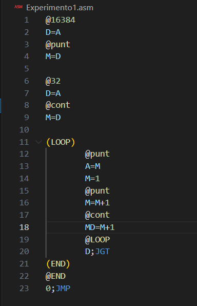

# Experimentos 

## Experimento 1: 
Hacer rayas verticales con lineas de puntos horizontales

Posible procedimiento: 
- Primero debo de establecer el tamaño de la pantalla. 512*256
- Tome el codigo de clase de puntos de forma horizontal 

Cambie el puntero por M=M+1 y el contador por MD=M+1
De esta forma logre que el codigo hiciera puntos por toda la pantalla de forma de lineas horizontales formando lineas verticales.

El contador lo inicalice en 32 para que llenara solo una linea de la pantalla por loop
## Experimento 2: 
Hacer una X en toda la pantalla
-Inicialmente intente hacer diagonales con 4 loops sumando el bucle para que baje una linea y se corra una a la derecha, pero no funciono y termino este dibujo 

